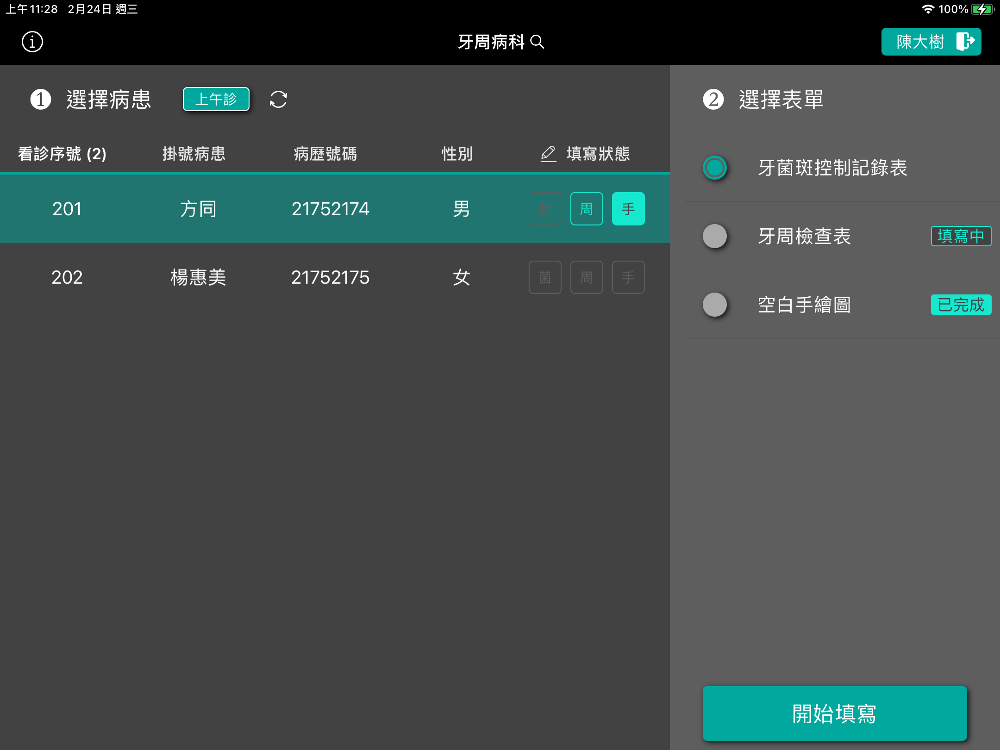
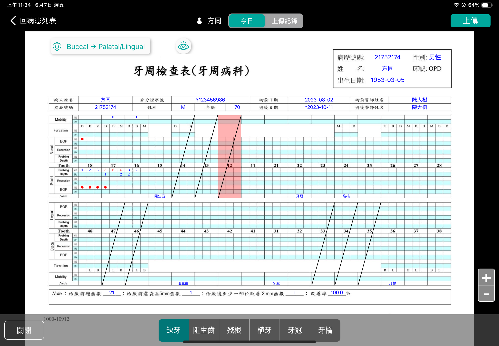
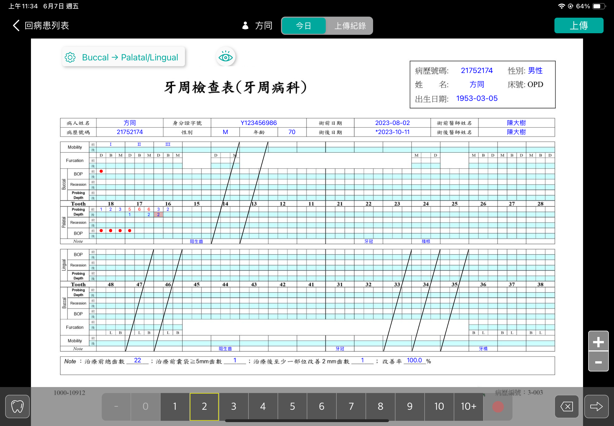

> <h4> DN100i </h4>

Implemented a digital form system for periodontology, improving the process of recording and statistical analysis of patient histories.

**<u>Team size: 3</u>**

- Served as project leader, collaborating with dentists to discuss clinical needs for recording plaque and periodontal disease control records, planning operational procedures and delegating implementation to iOS app developers.

> <h4> Screenshot </h4>

