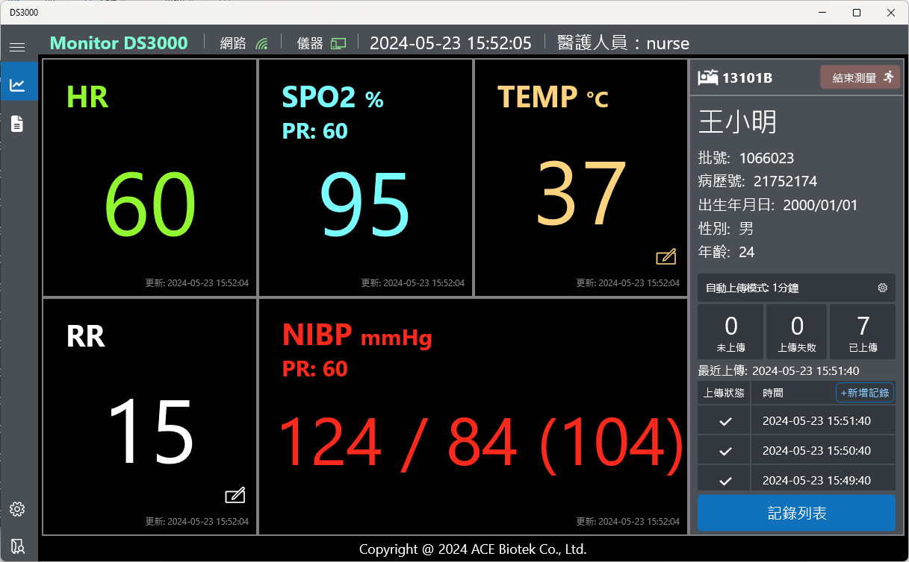
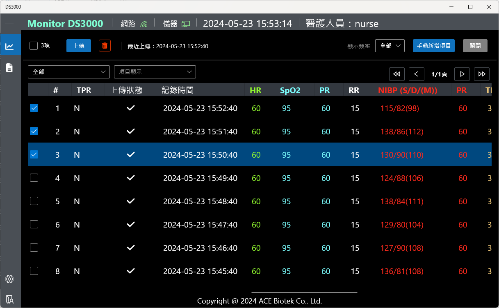

> <h4> DS3000 </h4>

A patient monitoring system that enables real-time monitoring of patient parameters and access to historical records.

- Assisted colleagues in developing certain functionalities, including establishing data exchange mechanisms between pages, creating a historical data viewing interface, and handling data pagination.

> <h4> Screenshot </h4>

