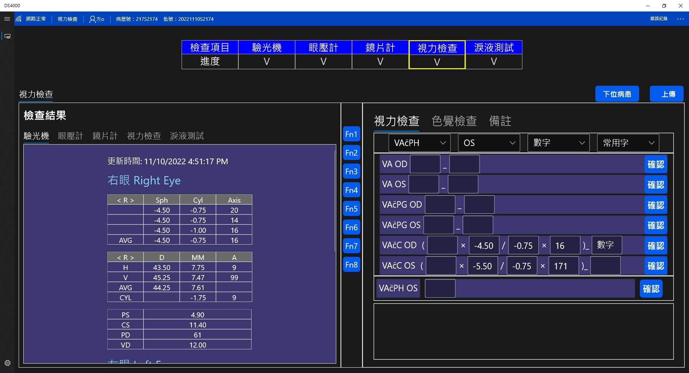
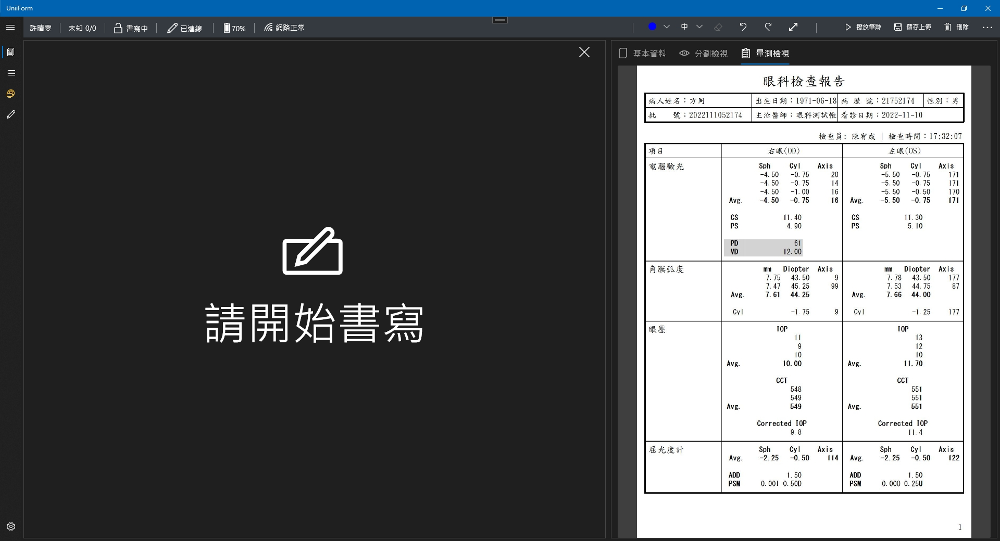

> <h4> EP100 </h4>

Integrated a data uploading system for ophthalmic instruments, combined with patient check-in processes to analyze data from various brands of ophthalmic instruments. Uploaded to backend services and integrated with UniiForm as part of electronic medical records.

**<u>Team size: 5</u>**

- Served as project leader, collaborating with physicians and optometrists to discuss clinical workflows and requirements, reducing paper-based transmission processes and implementing them at the medical center in Hualien.

- Assisted developers in timely restructuring of program modules and adjusting custom requirements, allowing colleagues to focus on completing core system functionalities.

> <h4> Screenshot </h4>

