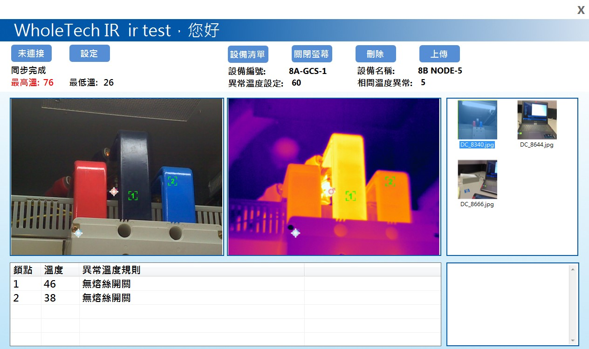

> <h4> Thermal Imaging Plant Inspection System </h4>

Integrated advanced thermal imaging (FLIR) to achieve instant image capture and transmission while automatically detecting temperature points, effectively reducing the time previously spent manually exporting images and marking temperature information.

- Regularly synchronize photos from the thermal imaging to the tablet, automatically determine if there are abnormal temperatures in the thermal images, and upload the thermal images and temperature information to the backend system for future reference.

- Establish a Wireless Ad Hoc Network on the tablet for connecting the thermal imaging.

- Utilize Address Resolution Protocol to periodically scan devices, and then synchronize thermal images via FTP.

> <h4> Screenshot </h4>

