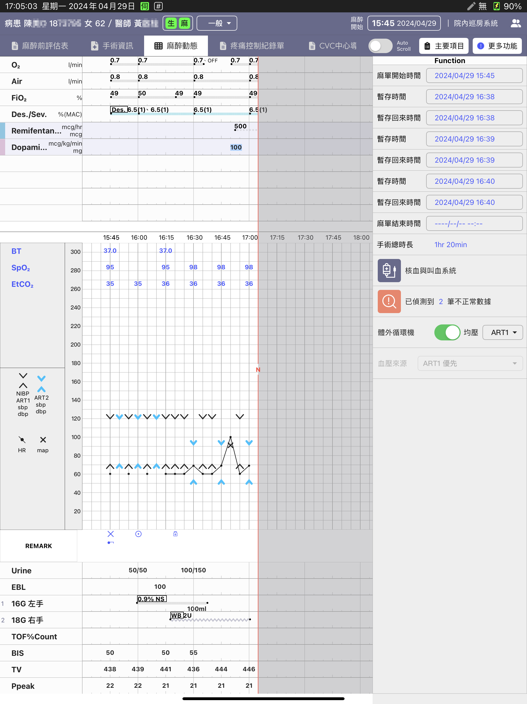
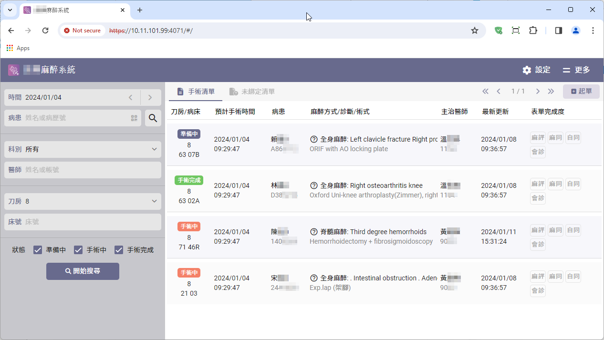
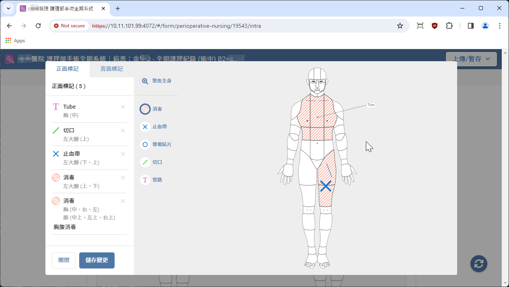
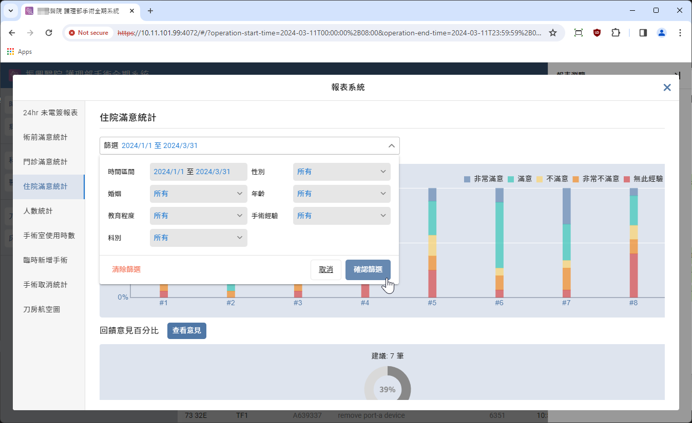

> <h4> Spark </h4>

Digital system covering the entire surgical process including nursing and anesthesia, integrating operating room instrument data analysis.

**<u>Team size: 14</u>**, including iOS App, frontend, backend, embedded systems, UI/UX.

- Led the project, closely collaborating with head nurses, anesthesiologists, and anesthesia nurses to translate clinical knowledge and processes into a surgical lifecycle system centered around an App and Website.

- Acted as the technical discussion window, communicated with IT teams of client for system integration and API designing externally, while internally collaborating with backend, iOS App, and frontend teams to design data flows and system architecture.

- Assisted developers in troubleshooting programming issues such as frontend API parameter errors, backend database anomalies, and incorrect instrument data parsing protocols.

- This project is the largest system development undertaken by the company to date, marking the company's first comprehensive design of a digital system for pre-, intra-, and post-operative phases. It now serves as a template for future anesthesia system projects.

> <h4> Screenshot </h4>

