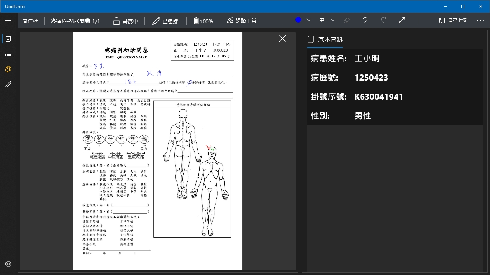
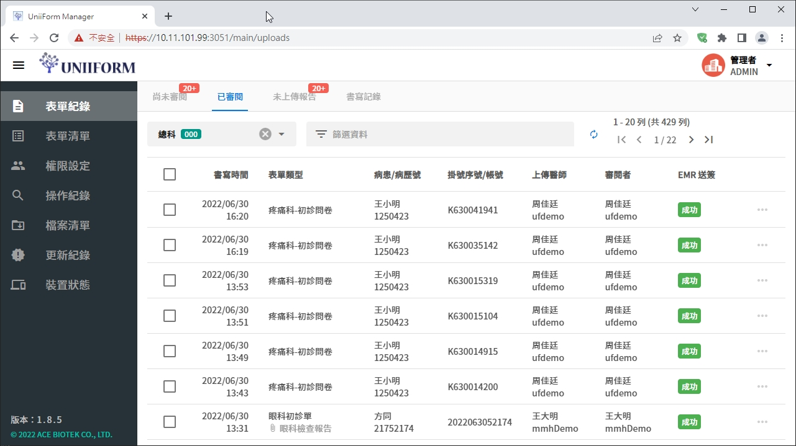

> <h4> UniiForm </h4>

Integrated with Bluetooth smart pen technology, this handwriting solution synchronizes handwriting in real-time to the application, primarily used for outpatient medical records digitalization and integration with electronic medical record systems. Additionally, the product offers a web platform for users to create forms and access handwriting records.

**<u>Team size: 6</u>**

- Led product planning and development, extracting common elements from various client business needs to design and establish a system including App, Server, Website, and Toolkit.

- As project lead and technical discussion window, collaborated with end users, administrative management, and technical units to successfully implement the product across industries:

  - Healthcare sector: Implemented in 4 medical centers, 2 regional hospitals, and 1 district hospital.
  
  - Non-healthcare industries: Pilot sites include wastewater treatment centers (Industrial Development Bureau's project), metal processing industries, demonstration sites for aquaculture product traceability systems (Fisheries Agency), and organic farms, totaling 5 clients.
  
- Established the UWP (Universal Windows Platform) App system architecture and system update mechanism, becoming a template for the company's UWP App architecture.

- Planned and implemented product key mechanisms, including online, offline, and dongle verification methods, ensuring robust software license protection.

- This product was a major business initiative for the company in its early to mid-term stages, accounting for approximately 40% of operations.

> <h4> Screenshot </h4>

[filename](../_assets/uniiform.mp4 ':include :type=video controls width=100%')
