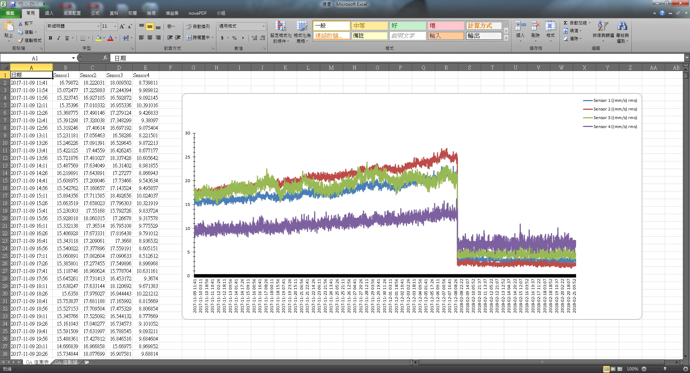

> <h4> Vibration Data Report System </h4>

After parsing extensive vibration data from machines, present it in report format. Through trend charts in the report, we can observe whether the equipment exhibits abnormalities.

- Parse vibration data (CSV file) and utilize Apache POI to present the data in Excel report format.

> <h4> Screenshot </h4>

