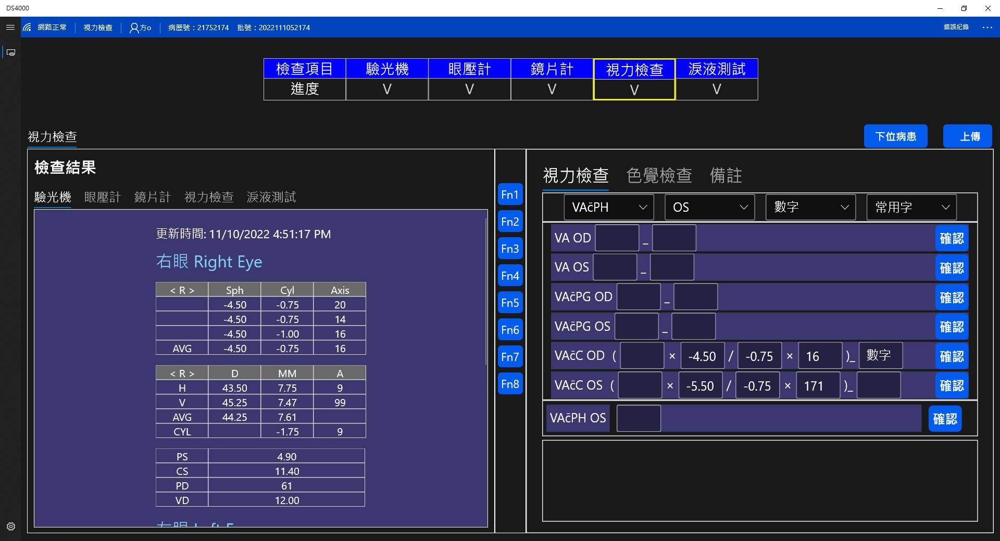
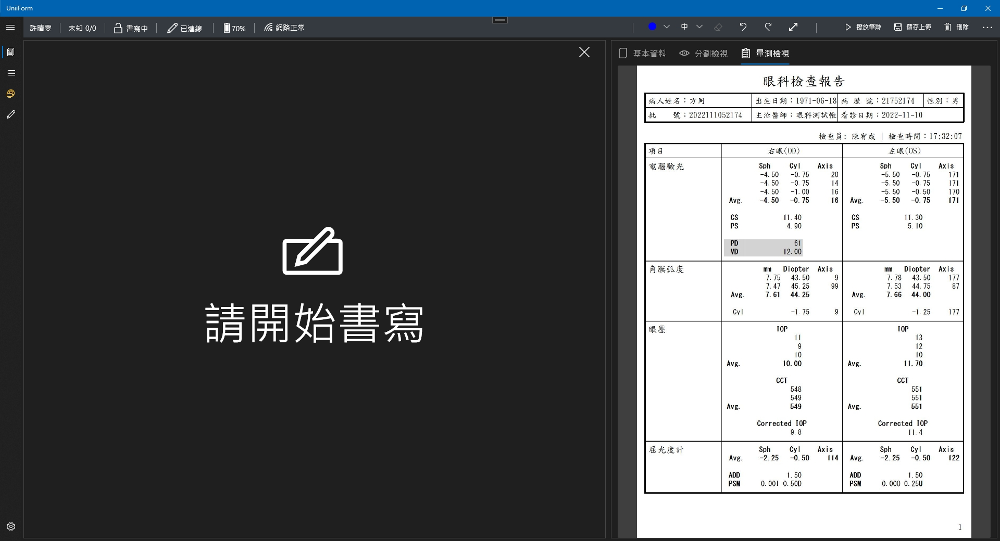

> <h4> EP100 </h4>

整合眼科儀器的數據上傳系統，結合病患報到流程並解析各廠牌眼科儀器數據，將其上傳至後台服務，並能夠與UniiForm結合成為電子病歷的一部分  
**<u>專案成員5人</u>**

- 擔任專案負責人，與醫師、驗光師討論臨床作業模式以及需求，減少過往的紙本傳遞流程，並導入至花東地區醫療中心

- 適時協助開發人員重構程式模組、調整客製化需求，讓同仁可專注完成系統主要功能

> <h4> Screenshot </h4>

