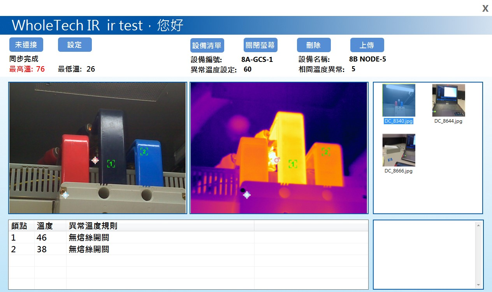

> <h4> 熱影像廠務巡檢系統 </h4>

整合高階熱像儀(FLIR)，進行影像即拍即傳並自動偵測溫點資訊，有效降低過往人工匯出影像與標記溫度的作業時間

- 定期將熱像儀內的照片同步至平板電腦，自動判斷熱影像的溫度是否異常，可將熱影像與溫度資訊上傳至後台系統，以便供日後查詢。

- 此系統可於平板電腦建立 Wireless Ad Hoc Network供熱像儀連接

- 透過 Address Resolution Protocol，定期掃描裝置，再以 FTP 同步熱影像

> <h4> Screenshot </h4>

