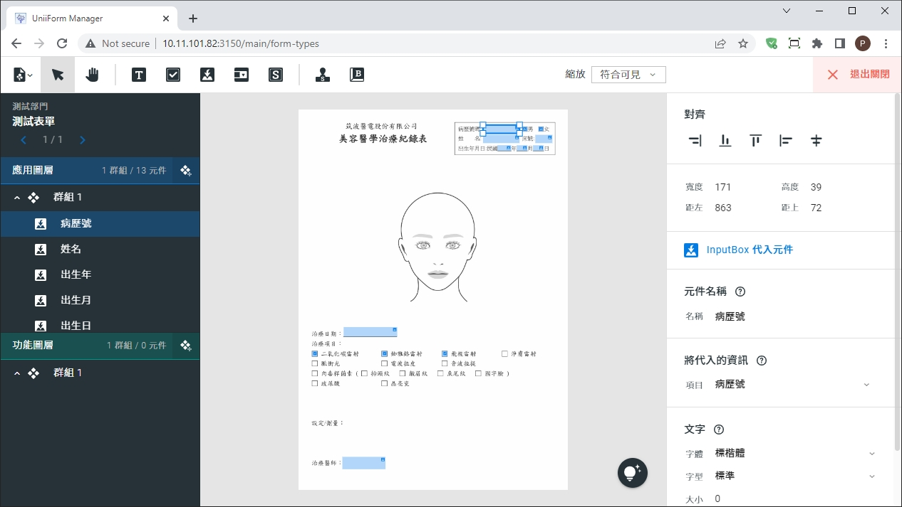

> <h4> Smart Menu </h4>

以Coded Form Generator為基礎，具備圖形化介面的線上製作表單工具  
**<u>專案成員6人</u>**

- 擔任項目主導者，與前端、後端以及設計人員協作，提供一套可應用於UniiForm的生產力工具與加值服務

- 過往的表單製作流程，皆須經客戶端提出申請，再由公司內部的工程師協助製作。此工具可將表單製作權轉移至客戶端、加速整體流程，同時也能夠減少公司人力成本

> <h4> Screenshot </h4>

[filename](../_assets/smart-menu.mp4 ':include :type=video controls width=100%')
