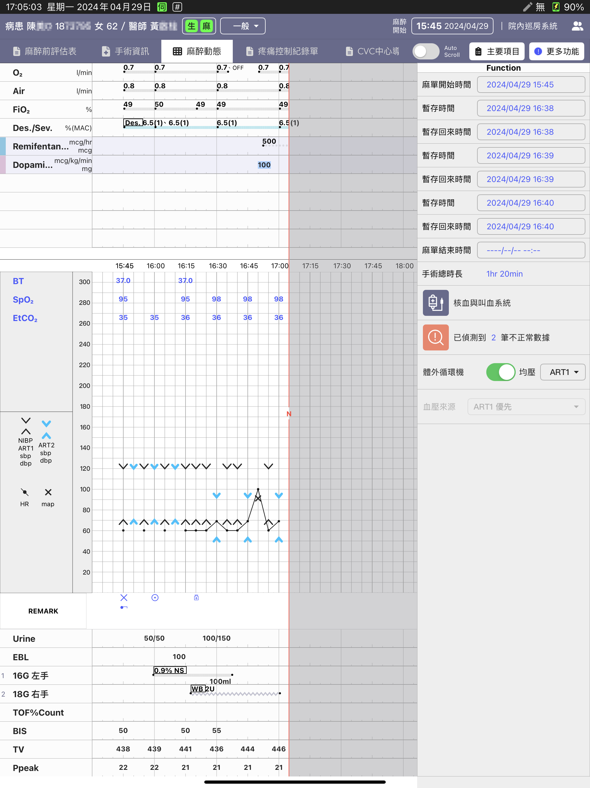
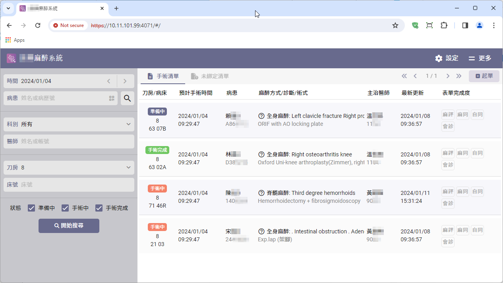
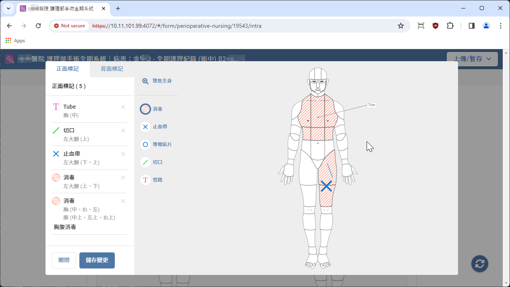
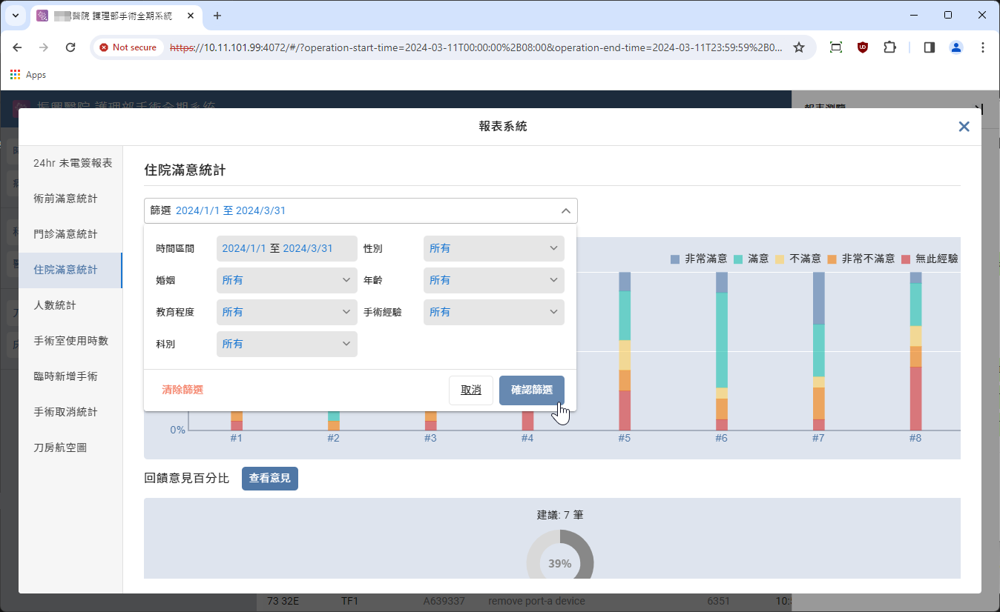

> <h4> Spark </h4>

涵蓋手術全期流程的護理與麻醉數位系統，同時整合手術室儀器數據解析  
**<u>專案成員14人</u>** ，包含iOS App, 前端, 後端,嵌入式系統, UI/UX

- 擔任專案負責人，與護理長、麻醉醫師、麻醉護理師密切合作，將臨床知識與流程轉化為由 App, Website 為主軸的手術全期系統

- 擔任技術窗口，對外與客戶端技術單位進行系統整合溝通及 API 規劃，對內則與後端、iOS App以及 前端同仁共同設計資料流程與系統架構

- 協助開發人員排查程式開發問題，包含: 前端呼叫 API 參數錯誤、後端資料庫資料異常、儀器數據解析協定有誤……等問題

- 本案為公司成立至今規模最大的系統開發案，也是公司首次接觸並設計一套完整的手術前、中、後期數位系統，目前已成為後續麻醉系統案件的範本

> <h4> Screenshot </h4>

