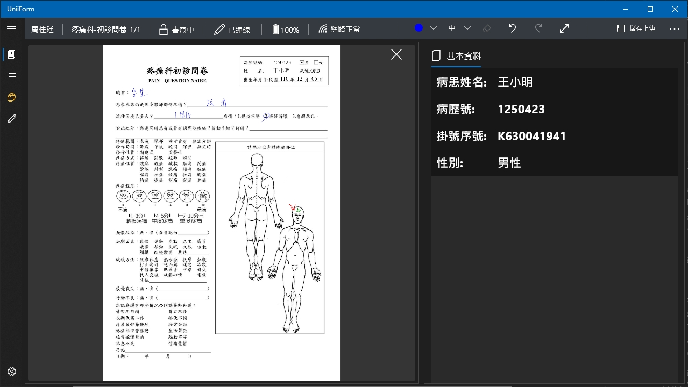
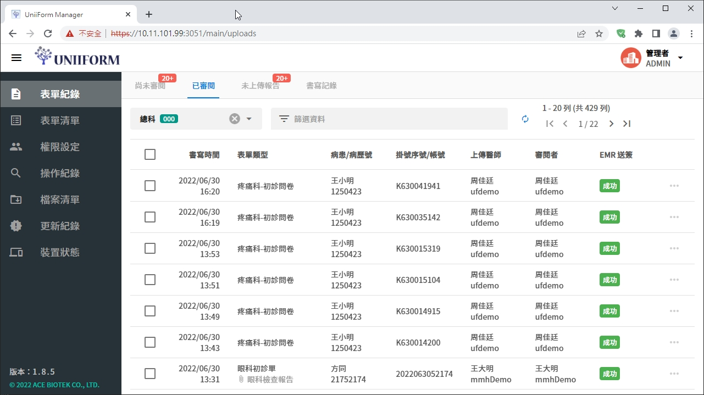

> <h4> UniiForm </h4>

結合藍牙智慧筆的手寫方案，可即時將書寫筆跡同步至應用程式，主要應用於門診病歷電子化並與電子病歷系統整合。另外，本產品也提供網頁平台方便使用者可進行表單製作以及查詢過往書寫紀錄。  
**<u>專案成員6人</u>**

- 擔任產品主要規劃與開發者，從不同客戶的業務需求中萃取出共通元素，設計並建立一套橫跨 App, Server, Website, Toolkit 的系統

- 作為專案負責人以及技術窗口，與客戶端的使用端、行政管理以及技術單位合作，成功將產品導入至各產業

    - 醫療業: 4間醫療中心、2間區域醫院以及1間地區醫院

    - 非醫療產業: 廢水處理中心(工業局計畫)、金屬加工業、水產品產銷履歷系統之示範場域(漁業署)、有機農場......等5個客戶

- 建立UWP (Universal Windows Platform) App系統架構與更新機制，後續成為公司UWP App的架構範本

- 規劃並導入產品金鑰機制，包含線上、線下、dongle等驗證方式，確保軟體授權可受到妥善保護

- 本產品為公司初期至中期的主要業務項目，佔比約40%

> <h4> Screenshot </h4>

[filename](../_assets/uniiform.mp4 ':include :type=video controls width=100%')
